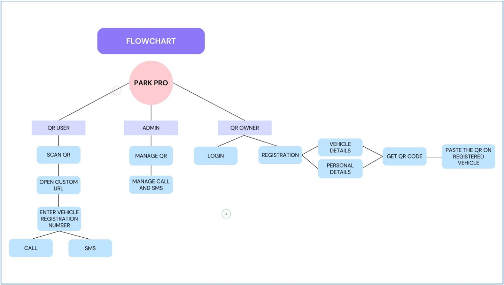

  <h1><b>PARK_PRO: QR-Based Box Parking Management System</b></h1>

---

### 📜 **Project Overview**
The **PARK_PRO** system is a web interface designed to address the common issue of blocked parking, particularly in scenarios known as "box parking." Box parking occurs when a vehicle is parked in such a way that it blocks other vehicles from exiting their parking space, leading to significant inconvenience for other drivers.

  

  
<i>Fig-1: Example of Box Parking</i>

---

### 🛠️ **How It Works**

#### 1. **User Registration**
Vehicle owners must first register on our portal by creating an account and providing essential details, such as their vehicle registration number, contact information, and other required personal information.

  
  
<i>Fig-2: Login Page</i>

After successful registration, the system generates a unique QR code for each user, linked to their vehicle's registration number.

  
  
<i>Fig-3: Registration Page</i>

---

#### 2. **QR Code Generation and Application**
Upon registration, a unique QR code is generated. This QR code must be printed and affixed to the vehicle in a visible location, such as the windshield or rear window. This code serves as a digital identifier, making it easy for others to contact the vehicle owner if their car is blocking access.

  
  
<i>Fig-4: Unique QR Code after Registration</i>

---

#### 3. **Blocked Vehicle Scenario**
If a user's vehicle is blocked by another, they can scan the QR code on the blocking vehicle using their smartphone. Upon scanning, they are redirected to a user-friendly interface with predefined options to either send a message or place a call to the vehicle owner. This quick process helps resolve the issue efficiently.

  
  
<i>Fig-5: Interface to Call or Message</i>

Additionally, users may be prompted to enter the vehicle registration number for confirmation.

  
  
<i>Fig-6: Prompt Asking for Vehicle Registration Number</i>

---

### 📈 **System Workflow**

The basic workflow of the PARK_PRO system is outlined in the flowchart below:

  
  
<i>Fig-7: Basic Flow of Work</i>

---

### 🌟 **Advantages**

- **Improved Communication:** The system facilitates direct contact between vehicle owners, reducing the communication gap and allowing users to quickly resolve parking issues without needing third-party intervention.

- **Time-Saving:** The predefined message and call options streamline the communication process, reducing the time it takes to contact the blocking vehicle's owner.

- **Increased Accountability:** The unique QR code ensures vehicle owners are easily identifiable and reachable, promoting responsible parking behavior.

- **Scalable and Easy to Implement:** The system is versatile and can be scaled to accommodate various parking facilities, making it suitable for residential, commercial, and public parking spaces.

---

### 🎯 **Conclusion**

PARK_PRO aims to enhance the parking experience by reducing frustration and fostering better communication among drivers. This leads to more efficient use of parking spaces and a reduction in traffic congestion, making parking a more stress-free experience for everyone involved.
